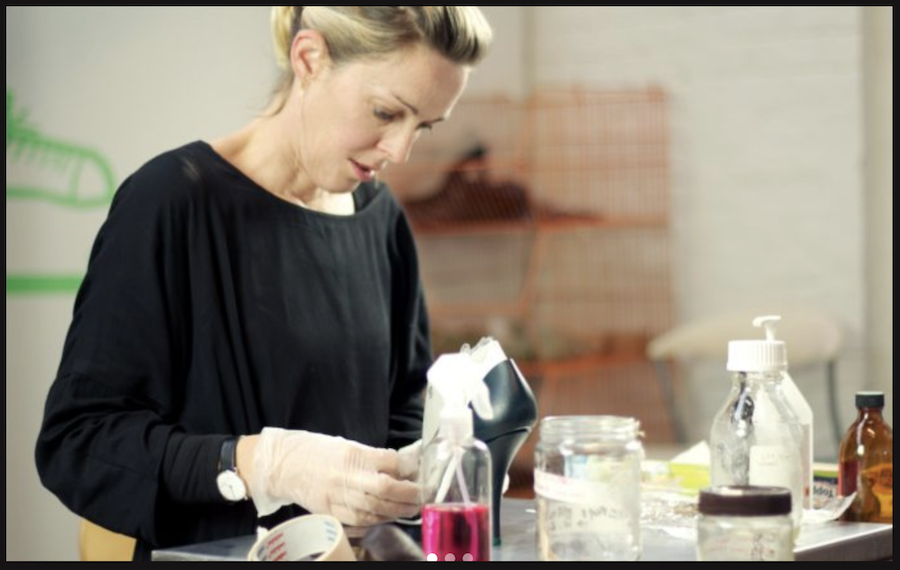
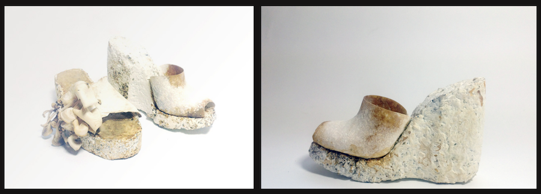
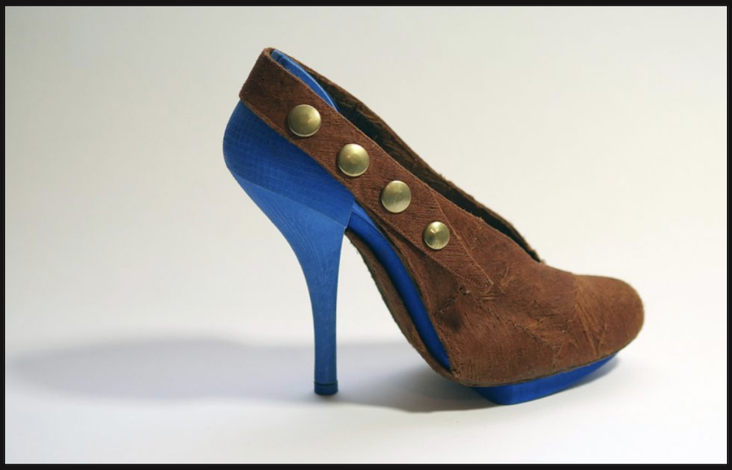
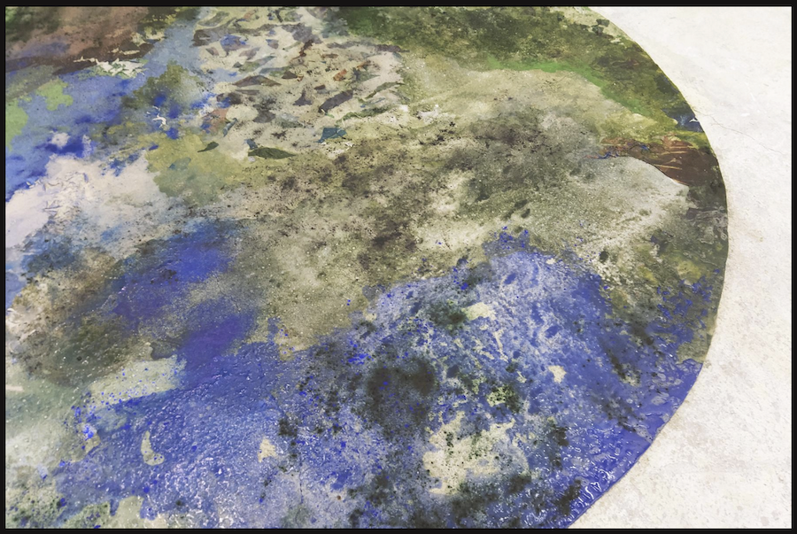
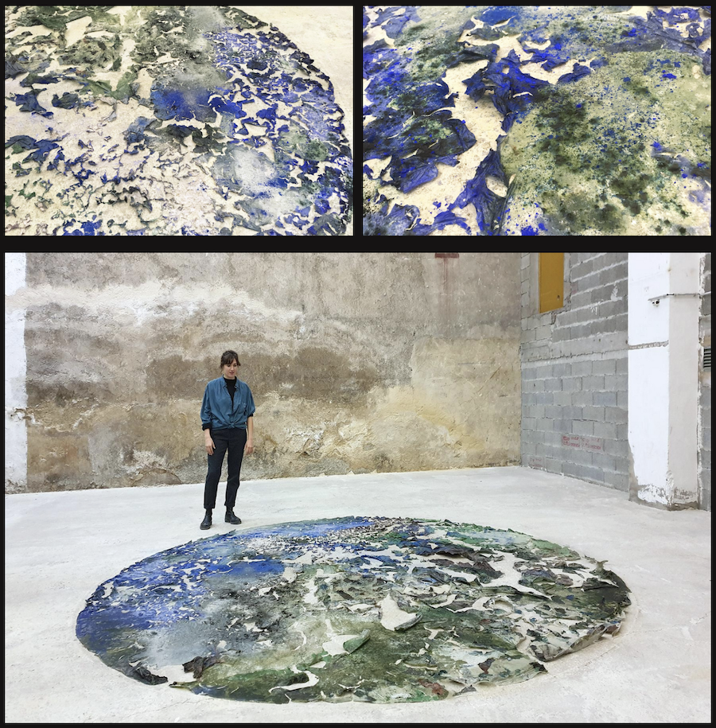
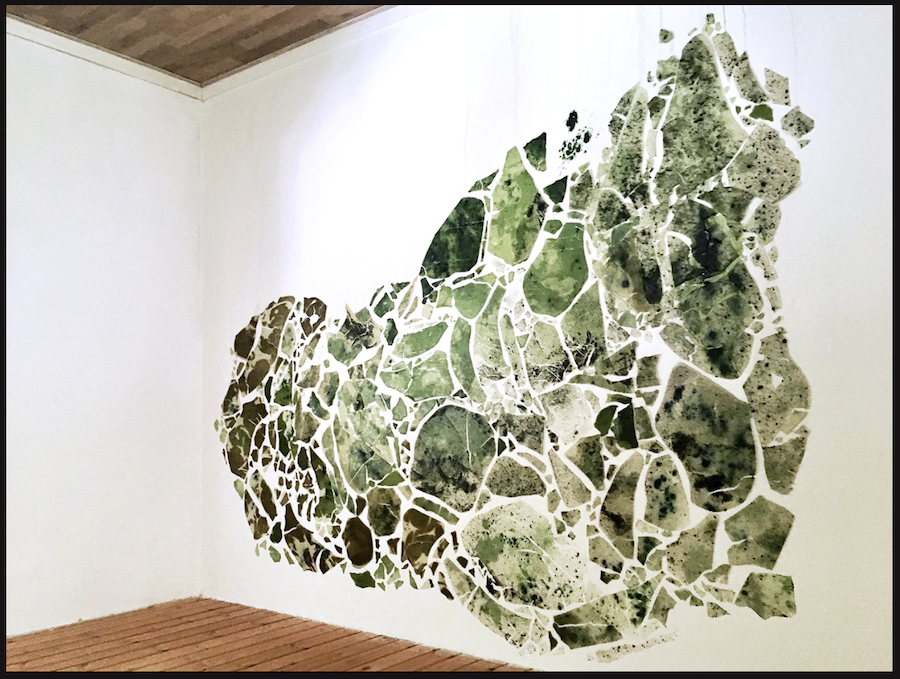
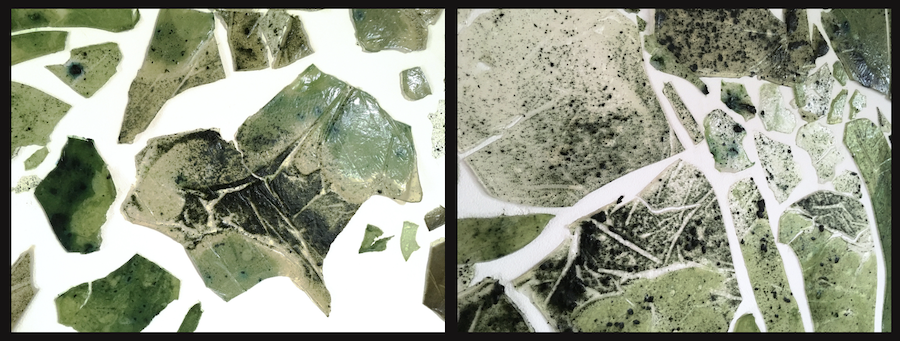

# 1. Biofabricating materials

## Research and inspiration

Looking close to home, I believe one of the first times I was introduced to using biomaterials as a source was when [Kristel Peters](http://shoedesigner.be/about-me/) presented her work during a lecture at the [Ghent Design Museum](https://www.designmuseumgent.be/).

Kristal is a shoe designer who focuses on sustainability. She uses circular economy models and looks for new materials with a low to no impact.

She grows shoes using mycelium. Don’t they look amazing?

But there’s also Alice. “Alice is a statement against and a potential solution for this immense waste created by fast fashion. In Upper 7, Alice wears an upper-coat made out of barkcloth. BARK CLOTH® **is the bast that comes from the Mutuba fig tree. The material or the cloth is manufactured from one single tree which produces a new annual bark and there is not added of additives – can, of course, this perfect product can be composted after use without leaving the only harmful substances.”

Wow!

Be sure to check her work!

Another artist who I think does amazing work with biomaterials, is [Charlotte Gautier van Tour](https://charlottegautiervantour.fr/).
Amongst other things, she makes big installations all over the world and allows the biomaterials to set in the space. They change over time while drying.
This works is called [Top View](https://charlottegautiervantour.fr/Top-View). I love it!

[Land of water](https://charlottegautiervantour.fr/Lands-of-Water) is based on a map of The Netherlands. Can you tell?
It’s a beautiful work of art, based on agar agar and spiruline. I cannot stop looking at it 🙂

## Biomaterials in the mix